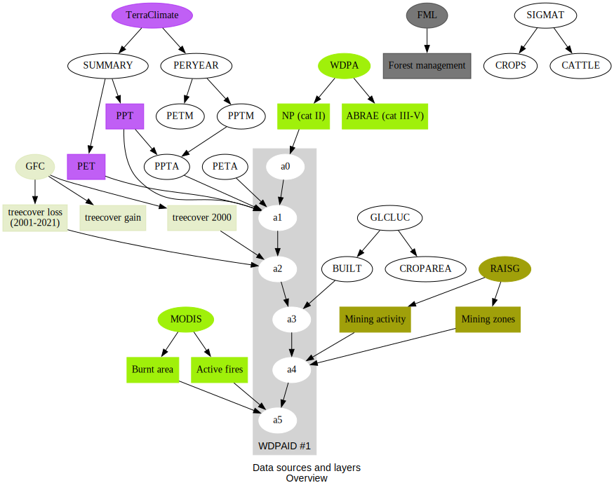

What kind of data do we need for analysing deforestation trends in a tropical country?

We started working on the problem of deforestation in Venezuela many years ago, and we have the challenge of combining global and regional data to make a complete picture of the problem. 

Some of the datasets included in this site have been tagged with [Venezuela](/docs/tags/venezuela) and [deforestation](/docs/tags/deforestation)

